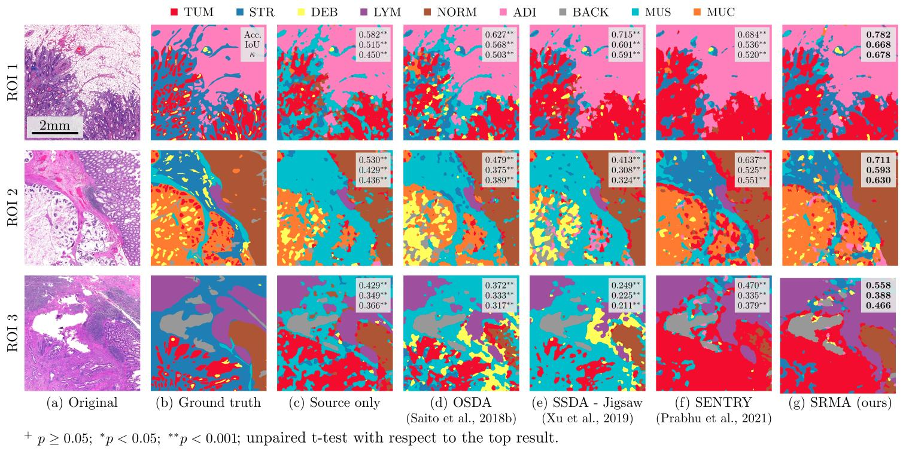

# Pytorch implementation [Self-Rule to Adapt (SRA)](https://openreview.net/forum?id=VO7asaS5GUk):
## Self-Rule to Adapt: Generalized Multi-source Feature Learning Using Unsupervised Domain Adaptation for Colorectal Cancer Tissue Detection

Supervised learning is constrained by the availability of labeled data, which are especially expensive to acquire in 
the field of digital pathology. Making use of open-source data for pre-training or using domain adaptation can be a 
way to overcome this issue. However, pre-trained networks often fail to generalize to new test domains that are not 
distributed identically due to variations in tissue stainings, types, and textures. Additionally, current domain 
adaptation methods mainly rely on fully-labeled source datasets.

In this work, we propose SRA, which takes advantage of self-supervised learning to perform domain adaptation and 
removes the necessity of a fully-labeled source dataset. SRA can effectively transfer the discriminative knowledge 
obtained from a few labeled source domain's data to a new target domain without requiring additional tissue annotations. 
Our method harnesses both domains' structures by capturing visual similarity with intra-domain and cross-domain 
self-supervision. Moreover, we present a generalized formulation of our approach that allows the architecture to learn 
from multi-source domains. We show that our proposed method outperforms baselines for domain adaptation of colorectal 
tissue type classification and further validate our approach on our in-house clinical cohort. The code and models are 
available open-source:


## Requirements
 
Dataset:
* [Kather16](https://zenodo.org/record/53169): Collection of textures in colorectal cancer 
histology containing 5000 histological images.
* [Kather19 - NCT-CRC-HE-100K](https://zenodo.org/record/1214456): 100,000 histological images of human colorectal cancer 
and healthy tissue.
* [CRCTP - Fold 2](https://warwick.ac.uk/fac/cross_fac/tia/data/crc-tp): 196,000 histological images of human colorectal cancer 
and healthy tissue.

Python (3.8)
* pytorch = 1.6.0
* cudatoolkit = 10.1
* torchvision = 0.4.0 
* albumentations = 1.0.0


## Usage
The pre-trained models (with and without the linear classifier) are available on the google
drive ([link](https://drive.google.com/drive/folders/1_4qa2JJPqMvEq6FgoTnmzkvPVgzQWma7?usp=sharing)). When using your 
own dataset, please follow the structure of the pytorch [ImageFolder](https://pytorch.org/vision/stable/datasets.html#torchvision.datasets.ImageFolder).

To train the model with single-source domain:
```bash
# Define variables
DATASET_SRC="/path/to/Kather19/NCT-CRC-HE-100K"
DATASET_TAR="/path/to/your_own_data"
# Train unsupervised architecture
python train_sra.py --root "${DATASET_SRC}:${DATASET_TAR}"
# Train linear classifier on top
# You can use the model provided on the google drive (checkpoint_sra_k19_inhouse.pth)
python train_sra_cls.py --name="kather19" --root "${DATASET_SRC}" --loadpath=/path/to/pretrained/model.pth
```

To train the model with multi-source domain:
```bash
# Define variables
DATASET_SRC1="/path/to/CRCTP/Training"
DATASET_SRC2="/path/to/Kather19/NCT-CRC-HE-100K"
DATASET_TAR="/path/to/your_own_data"
# Train unsupervised architecture
python train_sra.py --root="${DATASET_SRC1}:${DATASET_SRC2}:${DATASET_TAR}"
# Train linear classifier on top
# You can use the model provided on the google drive (checkpoint_sra_crctp_k19_inhouse.pth)
python train_sra_cls.py --name="crctp-cstr+kather19" --root "${DATASET_SRC1}:${DATASET_SRC2}" --loadpath=/path/to/pretrained/model.pth
```

## Results

We present the t-SNE projection of the results of domain adaptation processes from Kather19 
to our in-house dataset.


As well as the multi-source case


To validate our approach on real case scenario, we perform domain adaptation using our 
proposed model from Kather19 to whole slide image 
sections from our in-house dataset. The results are presented here, alongside the original 
H&E image, their corresponding labels annotated by an expert pathologist, as well as 
comparative results of previous approaches smoothed using conditional random fields as 
in [L. Chan](https://github.com/lyndonchan/hsn_v1) (2018). The sections were selected such that, 
overall, they represent all tissue types equally.



## Citation

If you use this work please use the following citations :).

```text
# Single-source domain adaptation
@inproceedings{
	abbet2021selfrule,
	title={Self-Rule to Adapt: Learning Generalized Features from Sparsely-Labeled Data Using Unsupervised Domain Adaptation for Colorectal Cancer Tissue Phenotyping},
	author={Christian Abbet and Linda Studer and Andreas Fischer and Heather Dawson and Inti Zlobec and Behzad Bozorgtabar and Jean-Philippe Thiran},
	booktitle={Medical Imaging with Deep Learning},
	year={2021},
	url={https://openreview.net/forum?id=VO7asaS5GUk}
}

# Multi-source domain adaptation (generalization)
@inproceedings{
	abbet2021selfrulegen,
	title={Self-Rule to Adapt: Generalized Multi-source Feature Learning Using Unsupervised Domain Adaptation for Colorectal Cancer Tissue Detection},
	author={Christian Abbet and Linda Studer and Andreas Fischer and Heather Dawson and Inti Zlobec and Behzad Bozorgtabar and Jean-Philippe Thiran},
	year={2021},
	url={TBA}
}
```

